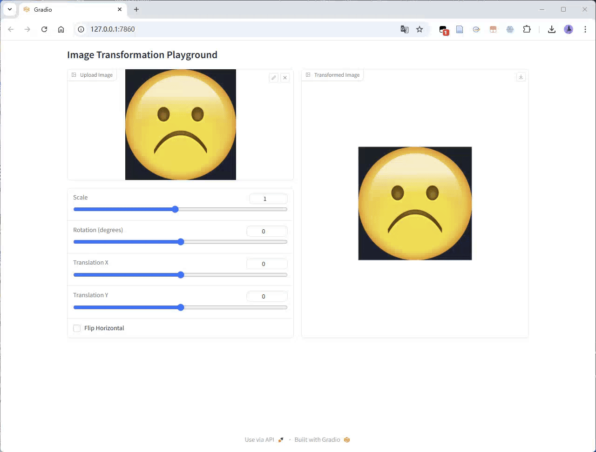

# Assignment 1 - Image Warping

### In this assignment, you will implement basic transformation and point-based deformation for images.

### Resources:
- [Teaching Slides](https://rec.ustc.edu.cn/share/afbf05a0-710c-11ef-80c6-518b4c8c0b96) 
- [Paper: Image Deformation Using Moving Least Squares](https://people.engr.tamu.edu/schaefer/research/mls.pdf)
- [Paper: Image Warping by Radial Basis Functions](https://www.sci.utah.edu/~gerig/CS6640-F2010/Project3/Arad-1995.pdf)
- [OpenCV Geometric Transformations](https://docs.opencv.org/4.x/da/d6e/tutorial_py_geometric_transformations.html)
- [Gradio: 一个好用的网页端交互GUI](https://www.gradio.app/)

### 1. Basic Image Geometric Transformation (Scale/Rotation/Translation).
Fill the [Missing Part](run_global_transform.py#L21) of 'run_global_transform.py'.


### 2. Point Based Image Deformation.

Implement MLS or RBF based image deformation in the [Missing Part](run_point_transform.py#L52) of 'run_point_transform.py'.
---
# Image Warping using Moving Least Squares

This repository is HongLiang Liu's  implementation of the image warping techniques described in the paper [Image Deformation Using Moving Least Squares](https://people.engr.tamu.edu/schaefer/research/mls.pdf). The project demonstrates both basic image transformations and point-guided deformations using the Moving Least Squares (MLS) algorithm.

## Environment
OS: Windows
Python: 3.11

### Environment Installation
use conda to install the virtual environment
### 1.Create virtual environment and activate it:
```
conda create -n DIP python=3.11
conda activate DIP
```

### 2.Install requirements
To install the required dependencies, run the following command:
```setup
pip install -r requirements.txt
```
This will install all necessary Python packages to run the code.

## Running
### Basic Transformation

To perform basic image transformations (e.g., affine, similarity, and rigid transformations), run the following command:

```
python run_global_transform.py
```
This script will apply various global transformations to an input image and display the results.

### Point-Guided Deformation
To perform point-guided deformation using the Moving Least Squares algorithm, run the following command:

```
python run_point_transform.py
```
This script allows you to interactively select points on an image and deform the image based on the movement of these points.

## Results
### Basic Transformation
Below is an example of the basic image transformation applied to an image:



### Point Guided Deformation:
Below is an example of point-guided deformation using the Moving Least Squares algorithm:


## Acknowledgement

>📋 Thanks for the algorithms proposed by [Image Deformation Using Moving Least Squares](https://people.engr.tamu.edu/schaefer/research/mls.pdf).
