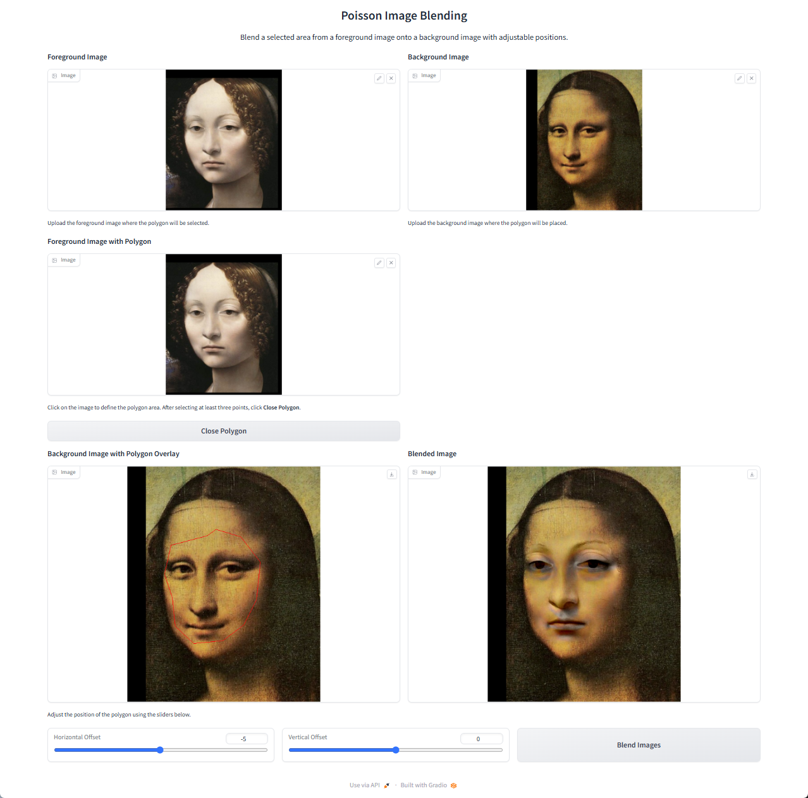
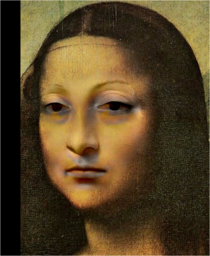
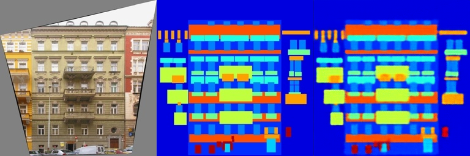
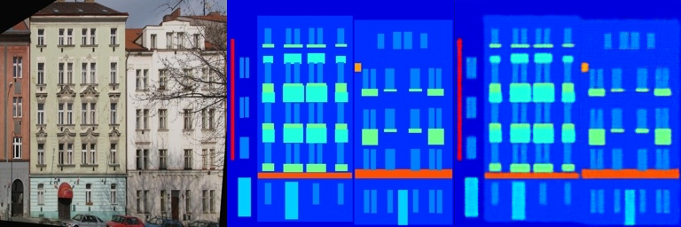
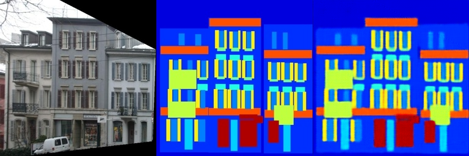
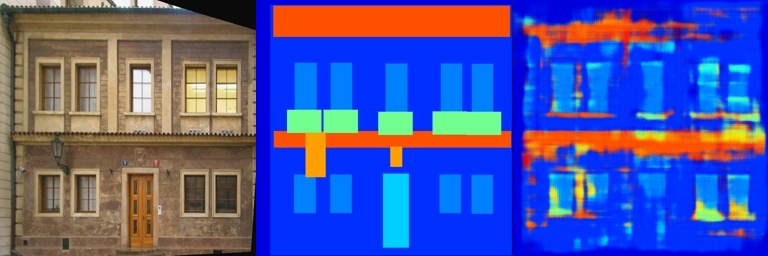
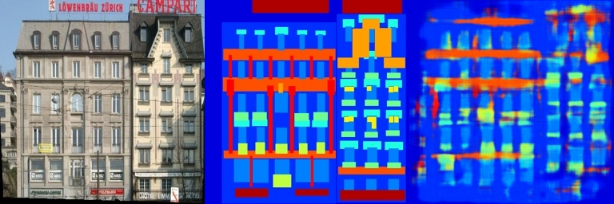
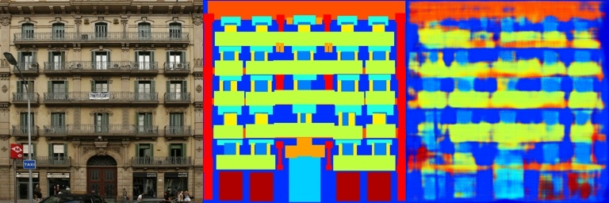
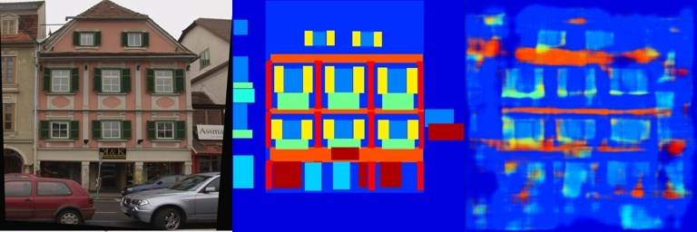

# Assignment 2 - DIP with PyTorch

### In this assignment, you will implement traditional DIP (Poisson Image Editing) and deep learning-based DIP (Pix2Pix) with PyTorch.

## Resources:
- [Assignment Slides](https://rec.ustc.edu.cn/share/705bfa50-6e53-11ef-b955-bb76c0fede49)  
- [Paper: Poisson Image Editing](https://www.cs.jhu.edu/~misha/Fall07/Papers/Perez03.pdf)
- [Paper: Image-to-Image Translation with Conditional Adversarial Nets](https://phillipi.github.io/pix2pix/)
- [Paper: Fully Convolutional Networks for Semantic Segmentation](https://arxiv.org/abs/1411.4038)
- [PyTorch Installation & Docs](https://pytorch.org/)

---

### 1. Implement Poisson Image Editing with PyTorch.
Fill the [Polygon to Mask function](run_blending_gradio.py#L95) and the [Laplacian Distance Computation](run_blending_gradio.py#L115) of 'run_blending_gradio.py'.


### 2. Pix2Pix implementation.
See [Pix2Pix subfolder](Pix2Pix/).

---
### Requirements:
- 请自行环境配置，推荐使用[conda环境](https://docs.anaconda.com/miniconda/)
- 按照模板要求写Markdown版作业报告

---

# DIP with PyTorch

This repository is HongLiang Liu's implementation of Assignment 2 - DIP with PyTorch

## Environment
OS : Windows

Environment : conda environment DIP created in Assignment 1

### 1.Install CUDA & Pytorch
There are several CUDA components that need to be installed, with the installation requirement being: 

**CUDA Driver version > CUDA Runtime version > CUDA version required for PyTorch to run**

#### install a newer graphics card driver based on the graphics card version. 

This determines the CUDA Driver version, which can be checked via the command 
```
nvidia-smi 
```
in the command line. The version I installed is 12.3.

#### Install the CUDA Toolkit, which determines the CUDA Runtime version. 
The installed version should be less than the CUDA Driver version, and can be checked via the command
```
nvcc -v 
```
in the command line.

#### Install the Pytorch with CUDA
Visit the PyTorch official website and select a PyTorch version that is less than the CUDA Driver version. After activating the virtual environment, the installation can be performed using the command line.

### 2.Install requirements
To install the required dependencies, run the following command:
```setup
pip install -r requirements.txt
```
This will install all necessary Python packages to run the code.


## Results:
### data possion

Blending the face of the Mona Lisa with the expression of Ginevra de Benci:




### Pix2Pix
#### Train result
Select some of the results produced during the training process:







##### Validation result 
Select some of the results generated by the model on the validation set:






