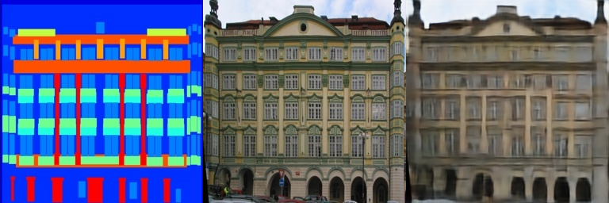
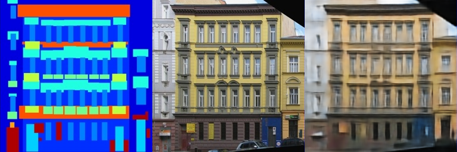
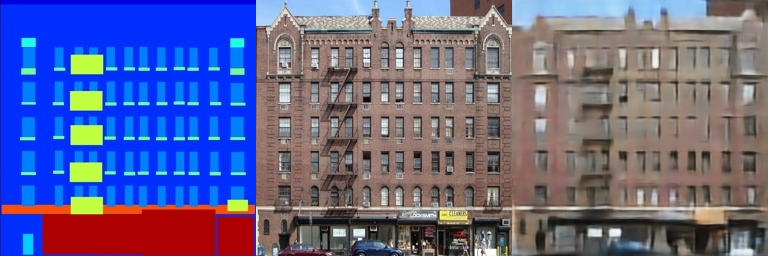
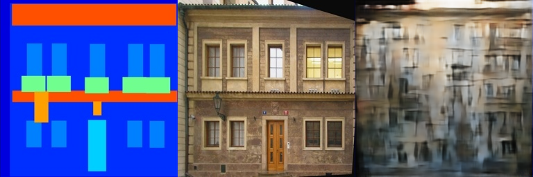
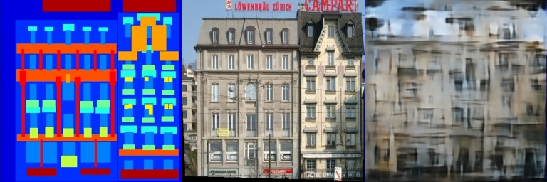
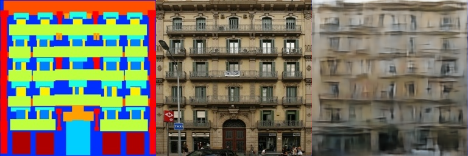

# Assignment 3 - Play with GANs

### In this assignment, you will implement two methods for using GANs in digital image processing.

### Resources:
- [DragGAN](https://vcai.mpi-inf.mpg.de/projects/DragGAN/): [Implementaion 1](https://github.com/XingangPan/DragGAN) & [Implementaion 2](https://github.com/OpenGVLab/DragGAN)
- [Facial Landmarks Detection](https://github.com/1adrianb/face-alignment)

---

See [作业03-Play_with_GANs.pptx](https://rec.ustc.edu.cn/share/705bfa50-6e53-11ef-b955-bb76c0fede49) for detailed requirements.

## Result
### Pix2Pix_GAN
#### **Train Results**

    
    
    

#### **Val Results**

    
    
    

### DragGAN
#### Auto Slim Face
https://github.com/user-attachments/assets/f2edd1e0-08a3-4dbe-9451-c4c416507144

#### Auto Close Mouth
https://github.com/user-attachments/assets/fcead837-8069-4d6a-9da8-6095ae1cb7a0
