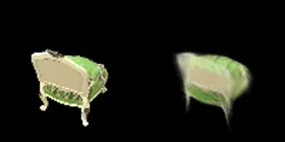
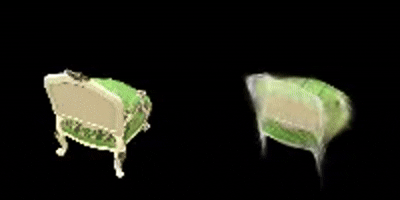
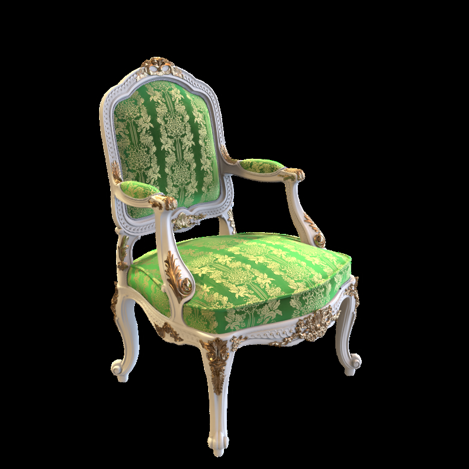
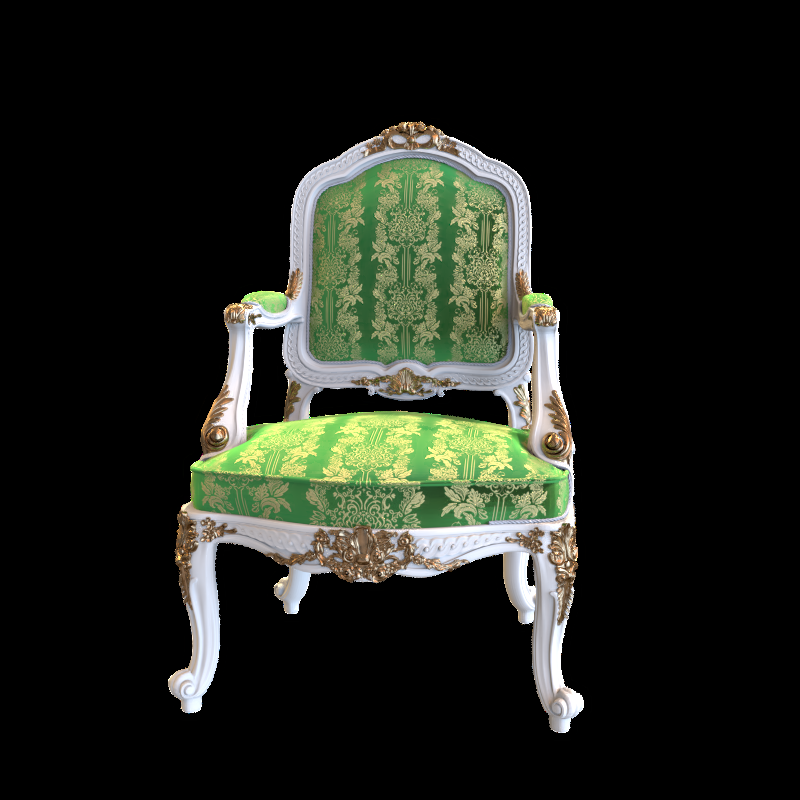
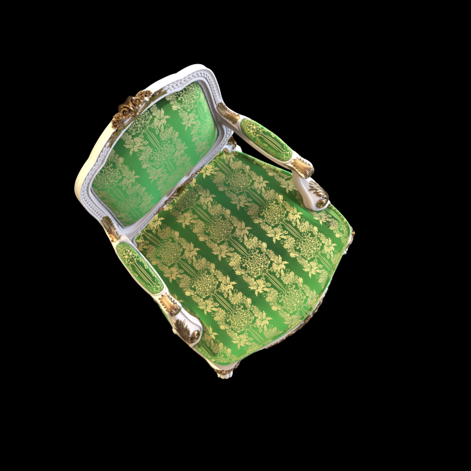
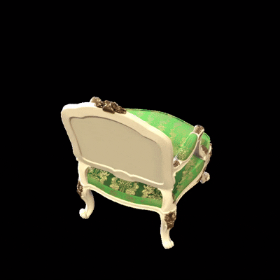
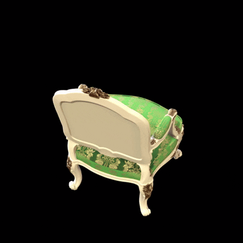

# Assignment 4 - Implement Simplified 3D Gaussian Splatting

This assignment covers a complete pipeline for reconstructing a 3D scene represented by 3DGS from multi-view images. The following steps use the [chair folder](data/chair); you can use any other folder by placing images/ in it.

### Resources:
- [Paper: 3D Gaussian Splatting](https://repo-sam.inria.fr/fungraph/3d-gaussian-splatting/)
- [3DGS Official Implementation](https://github.com/graphdeco-inria/gaussian-splatting)
- [Colmap for Structure-from-Motion](https://colmap.github.io/index.html)

---

### Step 1. Structure-from-Motion
First, we use Colmap to recover camera poses and a set of 3D points. Please refer to [11-3D_from_Multiview.pptx](https://rec.ustc.edu.cn/share/705bfa50-6e53-11ef-b955-bb76c0fede49) to review the technical details.
```
python mvs_with_colmap.py --data_dir data/chair
```

Debug the reconstruction by running:
```
python debug_mvs_by_projecting_pts.py --data_dir data/chair
```

### Step 2. A Simplified 3D Gaussian Splatting (Your Main Part)
From the debug output of Step 1, you can see that the 3D points are sparse for rendering the whole image. We will expand each point to a 3D Gaussian to make it cover more 3D space.

#### 2.1 3D Gaussians Initialization
Refer to the [original paper](https://repo-sam.inria.fr/fungraph/3d-gaussian-splatting/3d_gaussian_splatting_low.pdf). For converting 3D points to 3D Gaussians, we need to define the covariance matrix for each point; the initial Gaussians' centers are just the points. According to equation (6), for defining covariance, we define a scaling matrix S and a rotation matrix R. Since we need to use the 3D Gaussians for volume rendering, we also need the opacity attribute and the color attribute for each Gaussian. The volume rendering process is formulated with equations (1), (2), (3). [The code here](gaussian_model.py#L32) contains functions to initialize these attributes as optimizable parameters. You need to fill [the code here](gaussian_model.py#L103) for computing the 3D Covariance matrix from the quaternion (for rotation) and the scaling parameters.

#### 2.2 Project 3D Gaussians to Obtain 2D Gaussians
According to equation (5), we need to project the 3D Gaussians to the image space by transforming with the world to camera transformation *_W_* and the Jacobian matrix *_J_* of the projection transformation. You need to fill [the code here](gaussian_renderer.py#L26) for computing the projection.

#### 2.3 Compute the Gaussian Values
We need to compute 2D Gaussians for volume rendering. A 2D Gaussian is represented by:

$$
  f(\mathbf{x}; \boldsymbol{\mu}\_{i}, \boldsymbol{\Sigma}\_{i}) = \frac{1}{2 \pi \sqrt{ | \boldsymbol{\Sigma}\_{i} |}} \exp \left ( {-\frac{1}{2}} (\mathbf{x} - \boldsymbol{\mu}\_{i})^T \boldsymbol{\Sigma}\_{i}^{-1} (\mathbf{x} - \boldsymbol{\mu}\_{i}) \right ) = \frac{1}{2 \pi \sqrt{ | \boldsymbol{\Sigma}\_{i} |}} \exp \left ( P_{(\mathbf{x}, i)} \right )
$$

Here, $\mathbf{x}$ is a 2D vector representing the pixel location, $\boldsymbol{\mu}$ represents a 2D vector representing the mean of the $i$-th 2D Gaussian, and $\boldsymbol{\Sigma}$ represents the covariance of the 2D Gaussian. The exponent part $P_{(\mathbf{x}, i)}$ is:

$$
  P_{(\mathbf{x}, i)} = {-\frac{1}{2}} (\mathbf{x} - \boldsymbol{\mu}\_{i})^T \mathbf{\Sigma}\_{i}^{-1} (\mathbf{x} - \boldsymbol{\mu}\_{i})
$$

You need to fill [the code here](gaussian_renderer.py#L61) for computing the Gaussian values.

#### 2.4 Volume Rendering (α-blending)
According to equations (1-3), using these `N` ordered 2D Gaussians, we can compute their alpha and transmittance values at each pixel location in an image.

The alpha value of a 2D Gaussian $i$ at a single pixel location $\mathbf{x}$ can be calculated using:


$$
  \alpha_{(\mathbf{x}, i)} = o_i*f(\mathbf{x}; \boldsymbol{\mu}\_{i}, \boldsymbol{\Sigma}\_{i})
$$


Here, $o_i$ is the opacity of each Gaussian, which is a learnable parameter.

Given `N` ordered 2D Gaussians, the transmittance value of a 2D Gaussian $i$ at a single pixel location $\mathbf{x}$ can be calculated using:

$$
  T_{(\mathbf{x}, i)} = \prod_{j \lt i} (1 - \alpha_{(\mathbf{x}, j)})
$$

Fill [the code here](gaussian_renderer.py#L83) for final rendering computation.

After implementation, build your 3DGS model:
```
python train.py --colmap_dir data/chair --checkpoint_dir data/chair/checkpoints
```

### Compare with the original 3DGS Implementation
Since we use a pure PyTorch implementation, the training speed and GPU memory usage are far from satisfactory. Also, we do not implement some crucial parts like adaptive Gaussian densification scheme. Run the [original 3DGS implementation](https://github.com/graphdeco-inria/gaussian-splatting) with the same dataset to compare the results.

# Implement Simplified 3D Gaussian Splatting
This repository is HongLiang Liu's implementation of Assignment 4 - Implement Simplified 3D Gaussian Splatting

## Environment
OS : Windows

Environment : conda environment DIP created in Assignment 1

### 1.COLMAP
Download the release version on [colmap](https://github.com/colmap/colmap)

Choosing the right version, I choose [colmap-x64-windows-cuda.zip](https://github.com/colmap/colmap/releases/download/3.11.1/colmap-x64-windows-cuda.zip)

Unzip the colmap-x64-windows-cuda.zip and add the bin directory to the system path environment variable.

### 2.ffmpeg
Visit the [FFmpeg Builds](https://www.gyan.dev/ffmpeg/builds/) download page

Download [ffmpeg-7.1-essentials_build](https://www.gyan.dev/ffmpeg/builds/ffmpeg-git-essentials.7z)

Unzip the .7z file and add the bin directory to the system path environment variable.

Check for correct installation by typing
```
ffmpeg -version 
```
on the command line

### 3.Pytorch3D
Visit the [Pytorch3D releases](https://github.com/facebookresearch/pytorch3d/releases) page

Download [Version 0.7.8](https://github.com/facebookresearch/pytorch3d/archive/refs/tags/V0.7.8.zip) to DIP environment site-packages directory

Modify the setup.py file in the pyTorch3d directory:
```
extra_compile_args = {"cxx": ["-std=c++14"]}
```
to
```
extra_compile_args = {"cxx": []}
```
---
Using the CUB included with the CUDA toolkit causes compilation errors. Download version [CUB 1.17](https://github.com/NVIDIA/cub/releases/tag/1.17.0) and add it to the environment variables.

---

In the x64 Native Tools Command Prompt, execute the following commands:
```
set DISTUTILS_USE_SDK=1
set PYTORCH3D_NO_NINJA=1
cd \yourpath\pytorch3d
activate virtual environment
python setup.py install
```
After successful installation, the last line of the prompt is:
```
Finished processing dependencies for pytorch3d==0.7.8
```
## Usage
### Use Colmap to recover camera poses and a set of 3D points
```
python mvs_with_colmap.py --data_dir data/chair
```
### Run the following command to train the model
```
python train.py --colmap_dir data/chair --checkpoint_dir data/chair/checkpoints
```
### To continue training, use resume_train,py
The resume_train.py script provides a rendering interface, allowing you to promptly monitor the overall training progress.
```
python resume_train.py --colmap_dir ./data/chair --checkpoint_dir ./data/chair/checkpoints --resume ./data/chair/checkpoints/checkpoint_000180.pt --additional_epochs  80  --render_every 10         
```
## Results
<center>
    
    <div>Epoch 120</div>
</center>
<br>
<center>
    
    <div>Epoch 160</div>
</center>
<br>
<center>
    
    <div>Epoch 200</div>
</center>
<br>
<center>
    
    <div>Epoch 240</div>
</center>


## Compare with the original 3DGS Implementation
Implementation of the original 3DGS using the [colab template](https://github.com/camenduru/gaussian-splatting-colab) provided by the user camenduru

First upload the data of chair, including images and sparse.
Then execute the following code

```
!python train.py -s /content/gaussian-splatting/chair
```
The output is saved in the output folder and can be viewed with the following code

```
!python render.py -m /content/gaussian-splatting/output/fab6d4ae-2
!ffmpeg -framerate 3 -i /content/gaussian-splatting/output/fab6d4ae-2/train/ours_30000/renders/%05d.png -vf "pad=ceil(iw/2)*2:ceil(ih/2)*2" -c:v libx264 -r 3 -pix_fmt yuv420p /content/renders.mp4
!ffmpeg -framerate 3 -i /content/gaussian-splatting/output/fab6d4ae-2/train/ours_30000/gt/%05d.png -vf "pad=ceil(iw/2)*2:ceil(ih/2)*2" -c:v libx264 -r 3 -pix_fmt yuv420p /content/gt.mp4 -y
```


<center>
    <div align="center">
        
        
        
    </div>
    <div>Ground truth</div>
</center>
<br>
<center>
    <div align="center">
        
        
        
    </div>
    <div>Renders</div>
</center>
<br>

<center>
    <div align="center">
        
        
    </div>
    <div>Ground truth (left) & Renders (right)</div>
</center>

It can be observed that after 30,000 rounds of training, the rendered results have become extremely close to the real model, to the point where they are indistinguishable to the naked eye.
